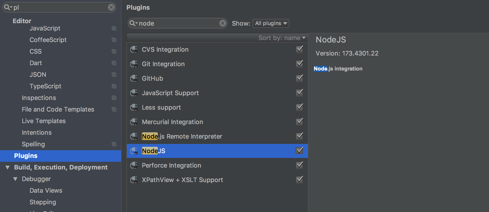
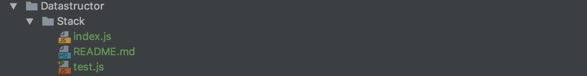
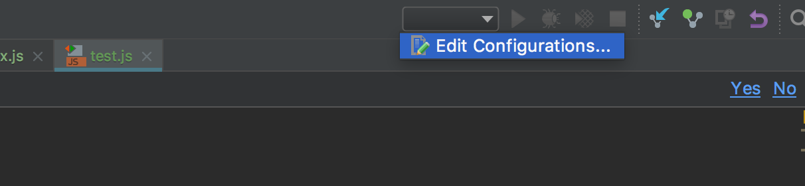
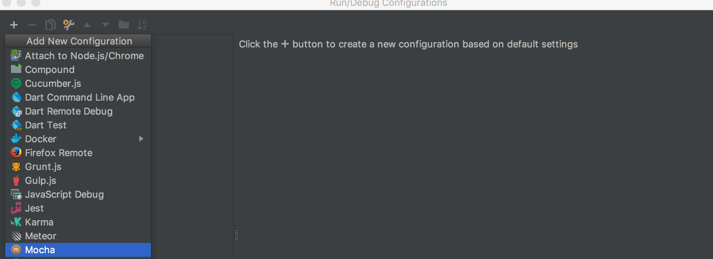
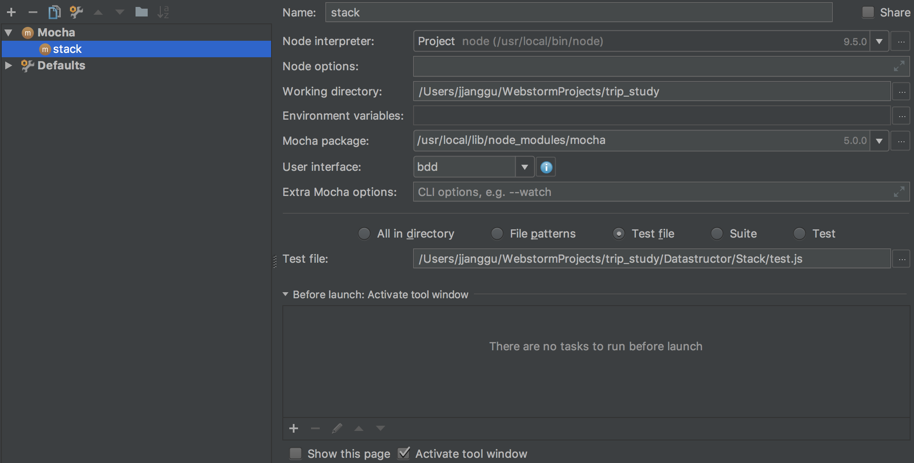
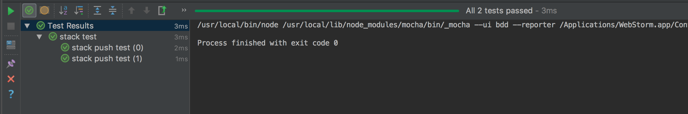

# 스터디

## 규칙
#### [ 벌금 ]

1차 : 1만원, 2차 이후 : 2만원 씩        
벌금은  식비로 활용할 에정

#### 커리큘럼

**자료구조 & 알고리즘 공부** (파트당 20분 설명)

- 배열(다임) 스택(석진) / ~2.20    
- 큐(보람) / ~ 2.27   
- 연결리스트(다임) / ~ 3.6
- 집합(석진) / ~ 3.14 
- 딕셔너리(보람) / ~3.20
- 트리(다임) / ~ 3.27
- 그래프(석진) / ~ 4.3


**인사이드 자바스크립트** (장당 20분 설명)
 
4. 함수와 프로토타입 체이닝 (보람)
5. 실행 컨텍스트와 클로저 (석진)
6. 객체지향 프로그래밍 (다임)  
/~ 2.20
7. 함수형 프로그래밍 (보람) /~ 2.27

## 기록 
#### 2018.02.20
- 각자 발표할거 준비해오기
- 자료구조 (배열, 스택), 인사이드 자바스크립트(4,5,6) 공부해오기
- 현금으로 27,000원 준비하기


## Mocha 환경구성 
혹시 웹스톰에 Node Plugin이 설치가 안되어있다면 설치해주세요


파일의 구성은 아래와 같습니다.

- index.js (구현체)
- test.js (테스트 파일)
- README.md (구현체에 대한 이론적인 설명)
 

아래는 웹스톰에서 Mocha를 사용하는 방법입니다.




후에 오른쪽 상단에 초록색 재생버튼을 누르면 테스트를 진행할 수 있습니다.


```js
const assert = require('chai').assert; // chai 를 사용합니다.

describe('테스트의 큰틀 ex. Stack Test', () => {
    it('세부기능 ex. push', () => {
      assert.equal('요청값', '기대값');
    });
});
```

참고 : [mocha](https://mochajs.org/) 사이트


